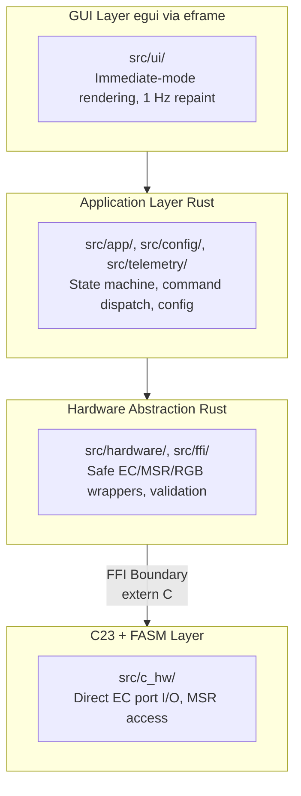

# Contributing to Linux NitroSense

Thank you for your interest in contributing! This document covers the development setup, code style, testing requirements, and PR process.

## Development Setup

### Prerequisites

- **Rust** 1.95.0+ — install via [rustup](https://rustup.rs/)
- **C23-capable compiler** — GCC 14+ or Clang 18+
- **FASM** (flat assembler) — optional; the build system falls back gracefully
- **pkg-config** — for system library detection

### Clone and Build

```sh
git clone https://github.com/user/linux-acer-nitrosense-app.git
cd linux-acer-nitrosense-app
cargo build
```

The `build.rs` script compiles C23 and FASM sources automatically. If FASM is not installed, assembly optimizations are silently disabled.

### Running Tests

```sh
# All unit and integration tests
cargo test

# With hardware integration tests (requires real Acer hardware + root)
cargo test --features hardware-tests

# Specific test binary
cargo test --test cli_e2e
cargo test --test packaging_assets
```

### Code Coverage

```sh
# Install cargo-llvm-cov
cargo install cargo-llvm-cov

# Generate coverage report
./scripts/coverage.sh

# HTML report with auto-open
./scripts/coverage.sh --open
```

Current coverage: **93.84%** line coverage across all modules.

### Benchmarks

```sh
cargo bench
```

Benchmarks cover EC operations, command handler, and power toggles. Results are saved under `target/criterion/`.

## Code Style

### Rust

- **Formatting:** `cargo fmt` is authoritative. All PRs must pass `cargo fmt --check`.
- **Linting:** `cargo clippy --tests -- -D warnings` must be clean. No warnings allowed.
- **Edition:** Rust 2024 (Edition 2024), MSRV 1.95.0.
- **Error handling:** Use `thiserror` for library error types, `anyhow` for application-level errors. Never panic in production code.
- **Unsafe code:** Only permitted in `src/ffi/` module. Every `unsafe` block must have a `// SAFETY:` comment documenting preconditions.
- **Naming:** Follow [Rust API Guidelines](https://rust-lang.github.io/api-guidelines/naming.html). Types are PascalCase, functions are snake_case.
- **Imports:** Group by crate (std, external, internal), alphabetized within each group.

### C

- **Standard:** C23 (ISO/IEC 9899:2024). Use `[[nodiscard]]`, `constexpr`, `static_assert`.
- **Naming:** `snake_case` for functions and variables. `CamelCase` for struct types.
- **Safety:** All FFI functions return `c_int` error codes (0 = success, negative = `-errno`). No direct pointer dereference without null checks.

### Assembly (FASM)

- **Syntax:** Intel syntax, ELF64 object output.
- **Calling convention:** System V AMD64 ABI.
- **Naming:** `asm_` prefix for all exported symbols (`asm_inb`, `asm_outb`, etc.).

## Testing Requirements

All contributions must include appropriate tests:

### Unit Tests

- Every new public function must have at least one unit test.
- Use the `MockEcDevice` trait implementation for EC-related tests.
- Use `tempfile::TempDir` for filesystem-related tests.
- C syscall mock tests must use `serial_test::serial` because `ec_set_ops` mutates a process-global table.

### Integration Tests

- Full command→handler→EC flow tests go in `tests/`.
- Hardware-dependent tests are gated behind `#[cfg(feature = "hardware-tests")]`.
- CLI E2E tests use `assert_cmd` + `predicates`.

### GUI Tests

- Use `egui_kittest` for headless GUI interaction testing.
- Test widget rendering and interaction via AccessKit pointer events.

### Coverage

- All modules must maintain > 80% line coverage.
- New code should not decrease overall coverage.

## PR Process

1. **Fork and branch:** Create a feature branch from `main`. Use descriptive names like `feature/fan-curve-editor` or `fix/ec-refresh-race`.

2. **Implement:** Write code and tests. Ensure all verification passes:
   ```sh
   cargo fmt --check
   cargo clippy --tests -- -D warnings
   cargo test
   cargo build --release
   ```

3. **Commit:** Use clear, descriptive commit messages. Focus on "why" not "what".

4. **Open PR:** Include:
   - Summary of changes
   - Test plan (what was tested, how)
   - Any breaking changes or migration notes

5. **Review:** Address review feedback. All CI checks must pass.

## Architecture Overview

The codebase follows a strict layered architecture with FFI boundaries:



### Key Patterns

- **Trait-based dependency injection:** `EcDevice`, `RgbDeviceWriter`, `ProcessRunner` enable testability without real hardware.
- **Transactional command handler:** `execute_command` snapshots state before writes; rolls back on EC failure.
- **Async/GUI bridge:** Telemetry uses `tokio::sync::watch` (latest-value semantics); commands use `tokio::sync::mpsc` (reliable delivery).
- **RAII cleanup:** All hardware resources (`Ec`, `Msr`) implement `Drop` for automatic cleanup.
- **Zero-allocation rendering:** The GUI render loop uses stack-allocated `FmtBuf<N>` buffers instead of `format!()`.

### Module Map

| Module | Responsibility |
|--------|---------------|
| `src/app/` | Application state, event handling, command dispatch |
| `src/ui/` | egui GUI panels (dashboard, fans, keyboard, settings, voltage) |
| `src/config/` | TOML configuration, legacy migration, atomic save |
| `src/hardware/` | EC abstraction, MSR, RGB, voltage, platform detection |
| `src/ffi/` | Safe FFI wrappers over C functions |
| `src/telemetry/` | Async polling loop, telemetry snapshots |
| `src/c_hw/` | C23 + FASM hardware layer (compiled via `build.rs`) |
| `src/error.rs` | Unified `NitroError` enum |

See [docs/architecture.md](docs/architecture.md) for detailed data flow diagrams and register map reference.
