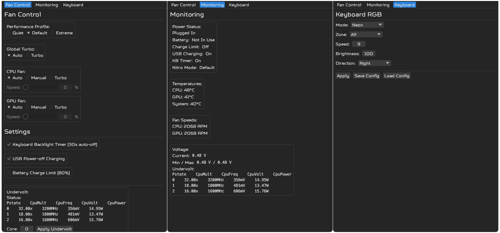
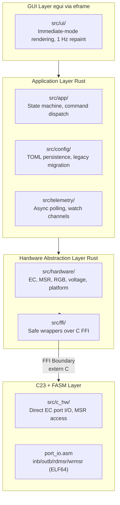

# Linux NitroSense

A systems-level rewrite of [Linux-NitroSense](https://github.com/flexer2006/Linux-NitroSense) in Rust/C/Assembly for Acer Nitro series laptops. Provides fan control, performance profiles, keyboard RGB, voltage monitoring, and system telemetry through a native GUI.



## Features

- **Real-time monitoring** — CPU/GPU/System temperatures, fan RPMs, power status at 1 Hz
- **Per-device fan control** — Auto, Manual (slider), and Turbo modes for CPU and GPU fans independently
- **Performance profiles** — Quiet, Default, and Extreme (Nitro) modes via Embedded Controller
- **Global Turbo toggle** — Simultaneous CPU+GPU turbo activation
- **Keyboard RGB control** — Zone, mode, speed, brightness, direction, color (requires [acer-predator-turbo-and-rgb-keyboard-linux-module](https://github.com/JafarAkhondali/acer-predator-turbo-and-rgb-keyboard-linux-module))
- **CPU undervolt** — AMD (via `amdctl`) and Intel (via MSR `0x198`) voltage monitoring and control
- **Battery care** — 80% charge limit toggle on supported models
- **USB power-off charging** toggle
- **Keyboard backlight** 30-second auto-off timer toggle
- **Persistent configuration** — TOML-based profiles stored under `/etc/nitrosense/`
- **Desktop integration** — `.desktop` entry, pkexec privilege elevation, custom icon and fonts
- **CLI fallback** — Headless mode for scripting (`--no-gui`, `--status`, `--set-profile`, `--set-fan-mode`)

## Performance

| Metric | Target | Achieved |
|--------|--------|----------|
| Cold startup (GUI visible) | < 100 ms | Measured via `Instant::now()` |
| RAM RSS (idle) | < 50 MB | 0 heap allocations per frame |
| CPU (1 Hz background poll) | < 0.5% | Sub-microsecond EC operations |
| Binary size | < 10 MB | 10.1 MB (with accessibility), 7.5 MB (without) |
| Test coverage | > 90% | 93.84% line coverage (454 tests) |

## Supported Models

| Model Family | Register Map | DMI Pattern | Status |
|---|---|---|---|
| AN515-45 | `AN515_46_REGS` | `Nitro AN515-45` | Primary |
| AN515-46 | `AN515_46_REGS` | `Nitro AN515-46` | Primary |
| AN515-54 | `AN515_46_REGS` | `Nitro AN515-54` | Primary |
| AN515-56 | `AN515_46_REGS` | `Nitro AN515-56` | Primary |
| AN515-57 | `AN515_46_REGS` | `Nitro AN515-57` | Primary |
| AN515-58 | `AN515_46_REGS` | `Nitro AN515-58` | Primary |
| AN515-44 | `AN515_44_REGS` | `Nitro AN515-44` | Primary |
| AN517-55 | `AN515_46_REGS` | `Nitro AN517-55` | Primary |

The application refuses to start with a clear error message on unsupported models.

## Prerequisites

### Required

- **Rust** 1.95.0+ (`rustup update stable`)
- **C23-capable compiler** — GCC 14+ or Clang 18+
- **FASM** (flat assembler) — optional; assembly optimizations are disabled gracefully if absent
- **Kernel modules** — `ec_sys` (with `write_support=y`) or `acpi_ec`

### Optional

- [acer-predator-turbo-and-rgb-keyboard-linux-module](https://github.com/JafarAkhondali/acer-predator-turbo-and-rgb-keyboard-linux-module) — keyboard RGB control
- `amdctl` — AMD voltage monitoring and undervolt
- `msr-tools` — Intel voltage monitoring (MSR access via `/dev/cpu/N/msr`)

## Build

```sh
cargo build --release
```

The release binary is at `target/release/nitrosense`. The build system (`build.rs`) compiles C23 and FASM sources and links them into a static archive (`libnitro_hw.a`) automatically.

### Build Dependencies

| Tool | Purpose |
|------|---------|
| `cargo` | Rust build system |
| `cc` crate | Compiles C23 sources (`ec_lowlevel.c`, `msr_lowlevel.c`) |
| FASM | Compiles `port_io.asm` (optional; graceful fallback) |

## Install

```sh
sudo ./install.sh
```

The installer:
1. Checks for root privileges
2. Builds a release binary if not already present (never runs Cargo as root; delegates to `SUDO_USER`)
3. Installs the binary to `/usr/bin/nitrosense`
4. Creates a pkexec wrapper at `/usr/bin/nitro-sense`
5. Installs the `.desktop` entry to `/usr/share/applications/`
6. Installs the icon to `/usr/share/icons/hicolor/256x256/apps/`
7. Installs the polkit policy to `/usr/share/polkit-1/actions/`
8. Installs fonts to `/usr/local/share/fonts/nitrosense/`
9. Runs `fc-cache -f` to refresh the font cache
10. Creates `/etc/nitrosense/` with `0755` permissions

### Staged Install (for package builders)

```sh
DESTDIR=/tmp/staging ./install.sh
```

## Uninstall

```sh
sudo ./uninstall.sh
```

Removes all installed files. Prompts before removing `/etc/nitrosense/` (which may contain saved settings).

## Usage

### GUI Mode (default)

Launch from your desktop menu as "Linux NitroSense", or run:

```sh
nitro-sense
# or directly:
sudo nitrosense
```

The pkexec wrapper elevates privileges via polkit. The GUI provides three tabs:

- **Fan Control** — Performance profile selection, turbo toggle, per-fan mode and manual speed
- **Monitoring** — CPU/GPU/System temperatures, fan RPMs, power status, voltage readings
- **Keyboard** — RGB mode, zone, speed, brightness, direction, color picker (hidden if RGB devices unavailable)

### CLI Mode

```sh
# Print current status and exit
sudo nitrosense --status

# Set performance profile
sudo nitrosense --set-profile quiet
sudo nitrosense --set-profile default
sudo nitrosense --set-profile extreme

# Set fan mode
sudo nitrosense --set-fan-mode cpu auto
sudo nitrosense --set-fan-mode gpu turbo
sudo nitrosense --set-fan-mode cpu manual

# Headless continuous monitoring
sudo nitrosense --no-gui
```

## Troubleshooting

### "Unsupported model" error

Your laptop's DMI product name (read from `/sys/class/dmi/id/product_name`) is not in the supported models list. Check the value and open an issue with the model name and EC register map if available.

### EC access errors (Permission denied)

NitroSense requires either root or `cap_sys_rawio` + `cap_sys_admin` capabilities. The pkexec wrapper handles this automatically for GUI launches. For CLI usage, run with `sudo`.

### EC access errors (No such file or directory)

The kernel EC module is not loaded. Load it manually:

```sh
sudo modprobe -r ec_sys 2>/dev/null   # unload first (required if loaded without write_support)
sudo modprobe ec_sys write_support=y
```

If `ec_sys` is unavailable, the application falls back to `acpi_ec`:

```sh
sudo modprobe acpi_ec
```

### RGB keyboard controls not visible

The RGB panel is hidden when the required character devices are absent. Ensure the [acer-predator-turbo-and-rgb-keyboard-linux-module](https://github.com/JafarAkhondali/acer-predator-turbo-and-rgb-keyboard-linux-module) is loaded and both `/dev/acer-gkbbl-0` and `/dev/acer-gkbbl-static-0` exist.

### Voltage monitoring shows "Unsupported CPU"

AMD voltage monitoring requires `amdctl` installed and accessible in `$PATH`. Intel voltage monitoring requires MSR access via `/dev/cpu/N/msr` (load the `msr` kernel module: `sudo modprobe msr`).

### Fonts not rendering correctly

The installer copies TT Squares font files to `/usr/local/share/fonts/nitrosense/` and runs `fc-cache -f`. If fonts still don't render, manually refresh the font cache:

```sh
sudo fc-cache -f
```

## Architecture

The application is organized in strictly separated layers with explicit FFI boundaries:



See [docs/architecture.md](docs/architecture.md) for detailed data flow, command flow, and register map reference.

## Technology Stack

| Layer | Technology | Version | Role |
|-------|-----------|---------|------|
| Core + GUI | Rust | 1.95.0 (Edition 2024) | Application logic, state machine, GUI |
| GUI Framework | egui (via eframe) | 0.31+ | Immediate-mode, GPU-accelerated native GUI |
| Hardware Abstraction | C | C23 (ISO/IEC 9899:2024) | Low-level EC/MSR access |
| Micro-optimizations | x86_64 Assembly | FASM | Direct `inb`/`outb`/`rdmsr`/`wrmsr` |
| Async Runtime | tokio | 1.40+ | Async I/O, timers, process spawning |
| Serialization | serde + toml | Latest | TOML-based configuration |
| Logging | tracing | Latest | Structured logging, optional journald |

## License

This project is licensed under the GNU General Public License v3.0 — see the [LICENSE](LICENSE) file for details.

## Acknowledgments

- [flexer2006/Linux-NitroSense](https://github.com/flexer2006/Linux-NitroSense) — Original Python/PyQt6 application
- [JafarAkhondali/acer-predator-turbo-and-rgb-keyboard-linux-module](https://github.com/JafarAkhondali/acer-predator-turbo-and-rgb-keyboard-linux-module) — Kernel module for RGB keyboard control
