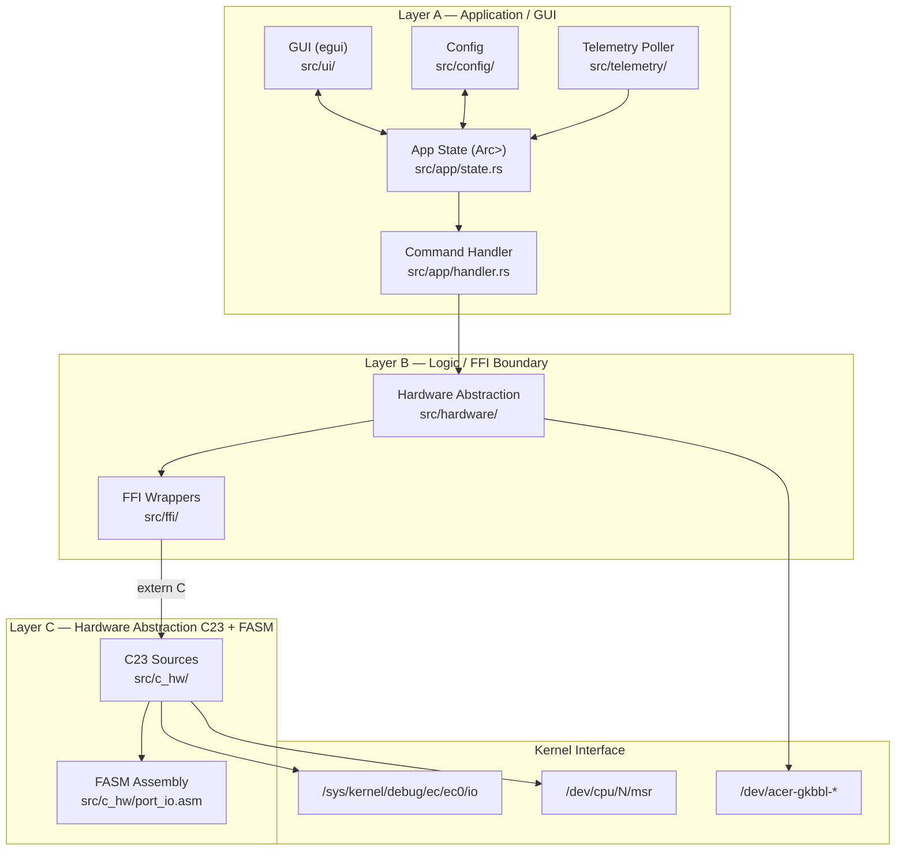
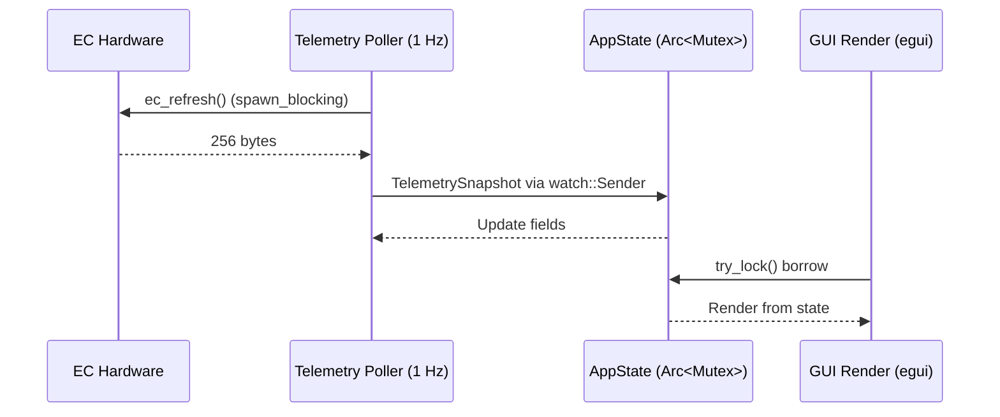
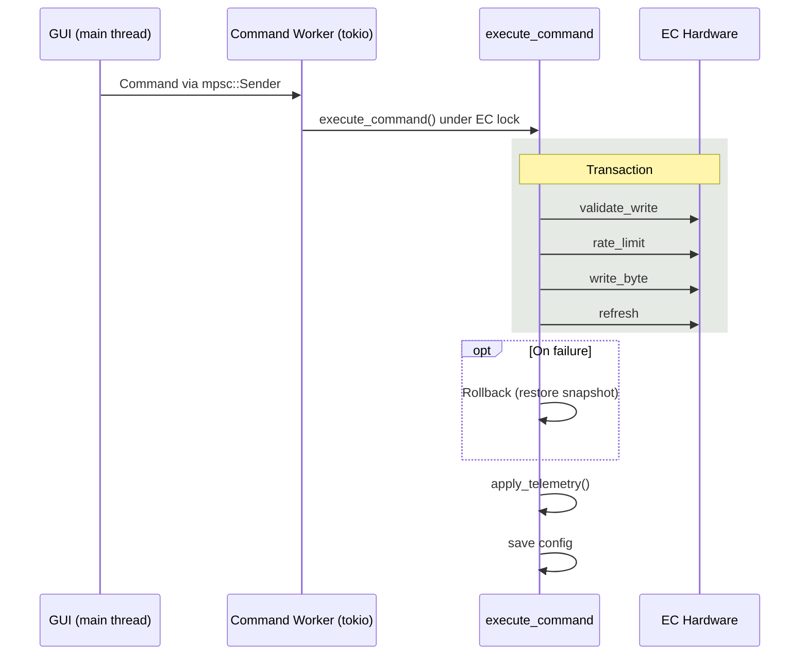
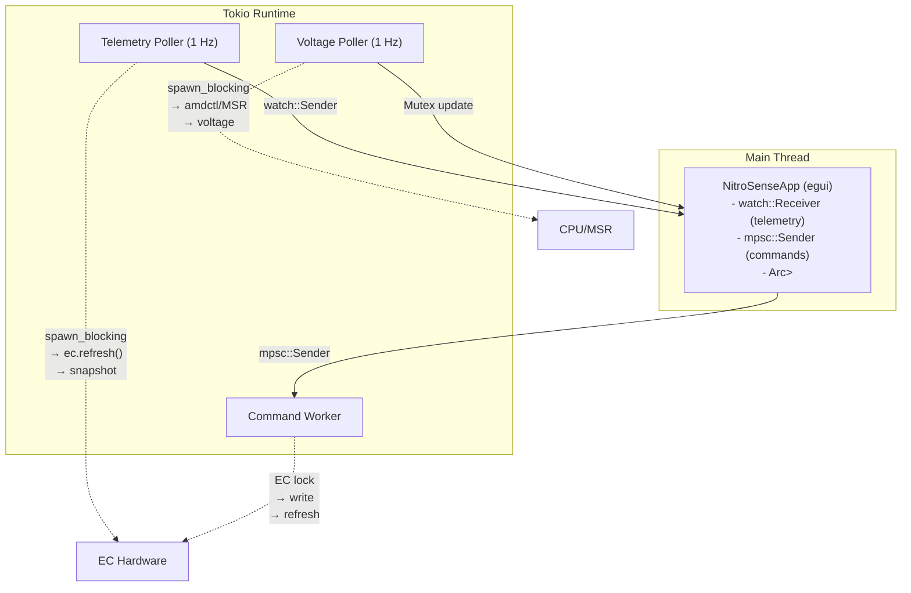

# Architecture Documentation

This document describes the layered architecture, data flows, and hardware interface of Linux NitroSense.

---

## Layer Diagram



---

## Data Flow: EC → Poller → State → GUI



### Sequence

1. **Poller** calls `ec.refresh()` via `spawn_blocking` (avoids blocking async runtime)
2. **Poller** extracts `TelemetrySnapshot` from the EC buffer
3. **Poller** sends snapshot through `watch::Sender` (latest-value semantics, no queue growth)
4. **GUI** checks `watch::Receiver::has_changed()` each frame
5. **GUI** acquires `AppState` lock and calls `apply_telemetry()`
6. **GUI** renders from the borrowed state (no clone in steady state)

### Voltage Polling (parallel)

A separate 1 Hz task polls CPU voltage:
- **AMD:** spawns `amdctl -g -c0` via `ProcessRunner` trait
- **Intel:** reads MSR `0x198` bits 47:32, divides by 8192

Results update `AppState.voltage`, `min_voltage`, `max_voltage`.

---

## Command Flow: GUI → Handler → EC



### Transactional Rollback

`execute_command()` snapshots `AppState` before any EC writes. If any write fails:
1. The original state is restored
2. An error is stored in `AppState.last_error`
3. The error is displayed as a dismissible banner in the GUI

### Command Enum

| Command | EC Action |
|---------|-----------|
| `SetCpuFanMode(mode)` | Write to `cpu_fan_mode_control` register |
| `SetGpuFanMode(mode)` | Write to `gpu_fan_mode_control` register |
| `SetCpuManualSpeed(level)` | Write `level * 10` to `cpu_manual_speed_control` (max 250) |
| `SetGpuManualSpeed(level)` | Write `level * 10` to `gpu_manual_speed_control` (max 250) |
| `SetProfile(profile)` | Write to `nitro_mode` register |
| `ToggleTurbo(on)` | Set both fans to Turbo + Extreme mode |
| `ToggleKbTimer(on)` | Write to `kb_30_sec_auto` register |
| `ToggleUsbCharging(on)` | Write to `usb_charging` register |
| `ToggleBatteryLimit(on)` | Write to `battery_charge_limit` register |
| `ApplyRgb(config)` | Write payloads to `/dev/acer-gkbbl-*` devices |
| `SaveRgbConfig` | Persist RGB config to `/etc/nitrosense/rgb.toml` |
| `LoadRgbConfig` | Load RGB config from `/etc/nitrosense/rgb.toml` |
| `ApplyUndervolt(core)` | Run `amdctl -m -v{vid}` or write MSR |
| `SaveConfig` | Persist main config to `/etc/nitrosense/nitrosense.toml` |
| `Shutdown` | Save config, cancel workers, close EC/MSR handles |

---

## Register Map Reference

### AN515-46 (Primary Register Map)

#### Fan Control

| Register | Address | Values | Description |
|----------|---------|--------|-------------|
| `cpu_fan_mode_control` | 0x22 | 0x04, 0x08, 0x0C | Auto, Turbo, Manual |
| `cpu_manual_speed_control` | 0x37 | 0–250 | Manual speed (UI level × 10) |
| `gpu_fan_mode_control` | 0x21 | 0x10, 0x20, 0x30 | Auto, Turbo, Manual |
| `gpu_manual_speed_control` | 0x3A | 0–250 | Manual speed (UI level × 10) |

#### Fan RPM (16-bit composite)

| Register | Address | Note |
|----------|---------|------|
| `cpu_fan_speed_high` | 0x13 | Low byte (despite name) |
| `cpu_fan_speed_low` | 0x14 | High byte (despite name) |
| `gpu_fan_speed_high` | 0x15 | Low byte |
| `gpu_fan_speed_low` | 0x16 | High byte |

**RPM calculation:** `(low << 8) | high` — preserves original Python byte ordering which matches hardware encoding.

#### Temperature Sensors

| Register | Address |
|----------|---------|
| `cpu_temp` | 0xB0 |
| `gpu_temp` | 0xB6 |
| `sys_temp` | 0xB3 |

#### Power & Battery

| Register | Address | Values | Description |
|----------|---------|--------|-------------|
| `power_status` | 0x00 | 0x01 | Plugged in |
| `battery_status` | 0xC1 | 0x01, 0x02 | Discharging, Charging |
| `battery_charge_limit` | 0x03 | 0x51/0x11 | Enable/disable 80% limit |

#### Toggles

| Register | Address | Values | Description |
|----------|---------|--------|-------------|
| `kb_30_sec_auto` | 0x06 | 0x00, 0x1E | Always on, 30s auto-off |
| `usb_charging` | 0x08 | 0x0F, 0x1F | Enabled, Disabled |

#### Performance Profiles

| Register | Address | Values | Description |
|----------|---------|--------|-------------|
| `nitro_mode` | 0x2C | 0x00, 0x01, 0x04 | Quiet, Default, Extreme |

### AN515-44 Differences

| Register | AN515-46 | AN515-44 |
|----------|----------|----------|
| `gpu_temp` | 0xB6 | 0xB4 |
| `sys_temp` | 0xB3 | 0xB0 |
| `battery_limit_on` | 0x51 | 0x40 |
| `battery_limit_off` | 0x11 | 0x00 |

All other registers are identical.

### Alternate Readback Values

The EC firmware may report alternate values at runtime. These must be recognized when reading but never written:

| Register | Canonical (write) | Alternate (read only) | Meaning |
|----------|-------------------|-----------------------|---------|
| CPU turbo mode | 0x08 | 0xA8 | Turbo enabled |
| GPU auto mode | 0x10 | 0x00 | Auto mode |

---

## EC Write Safety

All EC writes pass through a validation pipeline:

1. **Register whitelist** — Only known control registers accept writes
2. **Value validation** — Written values must match the allowed enum/bit-range for that register
3. **Rate limiting** — Minimum 50 ms between consecutive writes (protects EC firmware)
4. **Auto-refresh** — After any write, the full EC buffer is re-read to observe side-effects
5. **Transactional rollback** — If a multi-write command fails partway, state is restored

### Validation Table

| Register | Allowed Values |
|----------|---------------|
| `cpu_fan_mode_control` | `{cpu_auto_mode, cpu_turbo_mode, cpu_manual_mode}` |
| `gpu_fan_mode_control` | `{gpu_auto_mode, gpu_turbo_mode, gpu_manual_mode}` |
| `cpu_manual_speed_control` | `0..=250` (UI level × 10) |
| `gpu_manual_speed_control` | `0..=250` |
| `kb_30_sec_auto` | `{kb_30_auto_off, kb_30_auto_on}` |
| `usb_charging` | `{usb_charging_on, usb_charging_off}` |
| `battery_charge_limit` | `{battery_limit_on, battery_limit_off}` |
| `nitro_mode` | `{quiet_mode, default_mode, extreme_mode}` |
| Any other | Rejected: "not writable" |

Alternate readback values (`0xA8`, `0x00`) are **never** in the write whitelist.

---

## FFI Contract

### C Header Types

```c
struct ec_handle {
    int  fd;            // File descriptor for EC device
    bool uses_ec_sys;   // true = /sys/kernel/debug/ec/ec0/io
};

static_assert(sizeof(struct ec_handle) == 8);
```

### Rust Mirror

```rust
#[repr(C)]
pub struct EcHandle {
    pub fd: c_int,
    pub uses_ec_sys: bool,
}
```

Layout verified by test: `size_of::<EcHandle>() == 8`.

### Function Contract

All FFI functions follow the convention:
- Return type: `c_int` (0 = success, negative = `-errno`)
- Pointers: non-null and aligned (Rust side checks before passing)
- Thread safety: C layer uses no global mutable state except `ec_ops` (serialized with `serial_test`)

---

## Async Architecture



### Channel Semantics

| Channel | Type | Semantics | Purpose |
|---------|------|-----------|---------|
| Telemetry | `watch` | Latest-value | No queue growth; GUI always gets most recent |
| Commands | `mpsc` | Reliable delivery | Every user action is processed |
| Shutdown | `watch` | Broadcast | All workers observe the same signal |

---

## Configuration System

### File Layout

```
/etc/nitrosense/
├── nitrosense.toml    # Main config (profile, fan modes, toggles)
└── rgb.toml           # RGB keyboard config (mode, colors, speed)
```

### Save Strategy

Atomic save via temp file + `fsync` + `rename`:
1. Write to temporary file in same directory
2. `fsync` the temp file
3. Rename (atomic on same filesystem)

### Legacy Migration

The application automatically migrates legacy line-based config files:
- `nitrosense.conf` → `nitrosense.toml`
- `rbg.conf` → `rgb.toml`
- Direction values are shifted +1 (legacy saves `currentIndex()`, protocol requires 1-based)

---

## Build System

`build.rs` compiles the C23 + FASM layer:

1. Compiles `port_io.asm` with FASM → `port_io.o` (optional, graceful fallback)
2. Compiles `ec_lowlevel.c`, `msr_lowlevel.c` with `cc` crate (C23 standard)
3. Links object files into `libnitro_hw.a`
4. Cargo links the static archive via FFI

### Release Profile

```toml
[profile.release]
lto = "fat"
codegen-units = 1
strip = true
panic = "abort"
opt-level = 3
```
